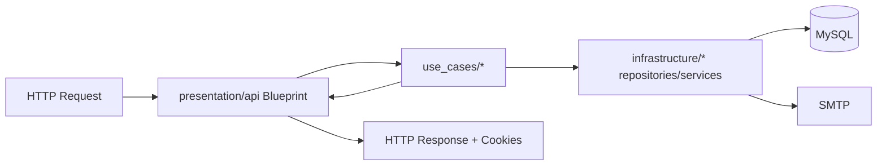
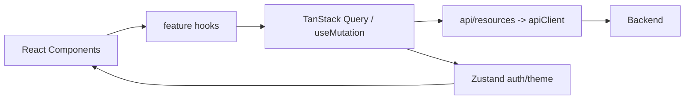

# PROJECT_GUIDE.md — Guía Maestra Técnica (SIRES)

> Este documento existe para evitar el típico quilombo: features nuevas que “andan” pero rompen la arquitectura, duplican lógica y vuelven el repo un basural.
>
> Si vas a tocar el proyecto, seguí esto. Si no, después no te quejes cuando todo sea inmanejable.

---

## TL;DR (para orientarte en 2 minutos)

- **Backend**: Flask con **blueprints** + una aproximación a **Clean Architecture** (use_cases / infrastructure / presentation).
- **Auth**: **JWT en cookies HttpOnly** + **CSRF token** en cookie accesible por JS y enviado en header `X-CSRF-TOKEN`.
- **Frontend**: Vite + React + TS, **React Router**, **TanStack Query** (server state), **Zustand** (UI/auth state), **Zod + RHF** (forms).
- **Convenciones**: commits estilo **Conventional Commits** (feat/refactor/fix/docs/chore + scope).
- **Testing**: hoy **no hay** (hay que ponerse las pilas; ver sección 7).

---

## 0. Contexto y Filosofía

Este repo tiene un objetivo claro: **sistema real** (SIRES) con seguridad razonable y estructura mantenible.

Principios que ya están implícitos en el código:

1. **Seguridad first**: tokens NO en localStorage. Cookies HttpOnly + CSRF.
2. **Separación de responsabilidades**: UI no decide reglas de negocio, backend sí.
3. **Feature modular** en frontend: `src/features/<feature>/...`.
4. **Backend con “casos de uso”**: la lógica vive en `use_cases/` y los adapters en `infrastructure/`.

---

## 1. Arquitectura del Proyecto

### 1.1 Estructura de carpetas (alto nivel)

```text
SIRES/
├─ backend/
│  ├─ src/
│  │  ├─ __init__.py                # create_app() + config JWT/CORS + blueprints
│  │  ├─ presentation/api/          # Flask routes (BluePrints) -> llamado a UseCases
│  │  ├─ use_cases/                 # “Application layer” (Business flows)
│  │  ├─ infrastructure/            # DB, repos, security, email, audit
│  │  ├─ domain/dto/                # DTOs (poco usado hoy)
│  │  └─ core/                      # errores base (DomainError)
│  └─ docs/                         # docs internas (rate limiting, auditoría)
│
├─ frontend/
│  ├─ src/
│  │  ├─ api/                       # client axios + resources + types + mocks
│  │  ├─ features/                  # módulos por dominio/feature (auth/dashboard/...)
│  │  ├─ components/                # layouts/shared/ui reutilizables
│  │  ├─ store/                     # Zustand stores (auth/theme)
│  │  ├─ routes/                    # Router + route guards
│  │  ├─ providers/                 # AppProviders (Query + Theme + Toaster)
│  │  └─ config/                    # env + query-client
│  └─ vite.config.ts                # aliases
│
└─ docker-compose.yml               # backend + frontend + redis
```

### 1.2 Patrón arquitectónico (lo real, no el cuento)

**Backend**: es *Clean-ish Architecture*.

- **presentation** (Flask Blueprints): parsing/validación básica de request + mapping de errores → HTTP.
- **use_cases**: orquestación de negocio (login, onboarding, reset password) y reglas.
- **infrastructure**: acceso a DB, hashing, JWT service, email, auditoría.
- **domain**: hay DTOs, pero hoy el dominio fuerte no está consolidado (se usa más dicts).

Ejemplo de `create_app()` registrando blueprints:

```py
# backend/src/__init__.py
from src.presentation.api.auth_routes import auth_bp
app.register_blueprint(auth_bp, url_prefix="/api/v1/auth")
```

**Frontend**: arquitectura por “capas funcionales”:

- `api/` define contratos (`types`) y adaptadores (`resources`).
- `features/` encapsula UI + hooks para cada feature.
- `store/` es estado global UI-ish.
- `routes/` define navegación y guards.

### 1.3 Capas y responsabilidades

#### Backend (request → respuesta)



- **Blueprint** decide HTTP status codes, valida campos mínimos, setea cookies.
- **UseCases** no deberían saber nada de Flask; devuelven `(result, error_code)`.
- **Repos** hablan con DB y devuelven dicts.

#### Frontend (UI → API → store)



- **TanStack Query** es para server state (requests, caching, retries).
- **Zustand** mantiene estado de UI/auth (user + flags), NO tokens.

### 1.4 Flujo crítico: autenticación con cookies HttpOnly

La app migró a un esquema decente:

- `access_token` y `refresh_token` van en **cookies HttpOnly**.
- CSRF: backend setea `csrf_access_token` (no HttpOnly) y frontend lo manda en `X-CSRF-TOKEN`.

Backend config (resumen):

```py
# backend/src/__init__.py
app.config["JWT_TOKEN_LOCATION"] = ["cookies"]
app.config["JWT_COOKIE_CSRF_PROTECT"] = True
app.config["JWT_ACCESS_CSRF_HEADER_NAME"] = "X-CSRF-TOKEN"
```

Frontend client:

```ts
// frontend/src/api/client.ts
withCredentials: true

// agrega X-CSRF-TOKEN para POST/PUT/PATCH/DELETE
config.headers["X-CSRF-TOKEN"] = csrfToken
```

---

## 2. Convenciones y Estándares

### 2.1 Nomenclatura

**Backend (Python)**
- Archivos: `snake_case.py`
- Clases: `PascalCase` (e.g. `LoginUseCase`)
- Métodos/vars: `snake_case`

Ejemplo:

```py
class CompleteOnboardingUseCase:
    def execute(self, user_id: int, new_password: str, terms_accepted: bool, client_ip: str):
        ...
```

**Frontend (TS/React)**
- Componentes: `PascalCase.tsx` (ej `LoginForm.tsx`)
- Hooks: `useXxx.ts`
- Types: `PascalCase` (interfaces/types)

### 2.2 Imports y aliases

Vite + TS configuran aliases:

```ts
// frontend/vite.config.ts
alias: {
  "@": "./src",
  "@features": "./src/features",
  "@api": "./src/api",
  ...
}
```

Convención: imports **externos → internos**.

Buen ejemplo:

```ts
import { useMutation } from "@tanstack/react-query";
import { toast } from "sonner";

import { authAPI } from "@api/resources/auth.api";
import { useAuthStore } from "@store/authStore";
```

### 2.3 Commits y branching

El historial muestra **Conventional Commits** + scope:

- `feat(frontend): ...`
- `fix(backend): ...`
- `refactor(frontend): ...`
- `docs(backend): ...`
- `chore: ...`

Branching sugerido (ya en README):
- `feature/<nombre>`

### 2.4 Formato de código / lint

Frontend:
- ESLint flat config (`frontend/eslint.config.js`) usando:
  - `@eslint/js` recommended
  - `typescript-eslint` recommended
  - `eslint-plugin-react-hooks`
  - `eslint-plugin-react-refresh`

TSConfig:
- `strict: true`
- `noUnusedLocals`, `noUnusedParameters`

Backend:
- No hay formatter/linter configurado (deuda). Hoy hay inconsistencias y typos (ej `exeptions.py` en comentario).

---

## 3. Patrones de Diseño Implementados

### 3.1 Use Case pattern (Application Service)

Los flujos viven en `backend/src/use_cases/auth/*`.

Patrón:

- `execute(...) -> (result, error_code)`
- El route layer mapea `error_code -> (httpStatus, message)`

Ejemplo (login):

```py
# backend/src/use_cases/auth/login_usecase.py
result, error = login_usecase.execute(usuario, clave, ip)
if error:
    return None, "INVALID_CREDENTIALS"
return result, None
```

### 3.2 Repository pattern

`UserRepository`, `DetUserRepository`, `PasswordResetRepository` encapsulan SQL y conexiones.

Ejemplo:

```py
# backend/src/infrastructure/repositories/user_repository.py
cursor.execute("SELECT ... FROM sy_usuarios WHERE usuario = %s LIMIT 1", (usuario,))
return cursor.fetchone()
```

### 3.3 Interceptors (frontend)

Axios interceptors para:
- CSRF header
- refresh automático en 401

```ts
// frontend/src/api/client.ts
if (error.response?.status === 401 && !originalRequest._retry) {
  await axios.post(`${env.apiUrl}/auth/refresh`, {}, { withCredentials: true });
  return apiClient(originalRequest);
}
```

### 3.4 Anti-patrones detectados (y cómo evitarlos)

1. **Inconsistencia de JWT**: En `auth_routes.py` se usa Flask-JWT-Extended para cookies, pero en `use_cases` se generan tokens con `infrastructure/security/jwt_service.py` (PyJWT).
   - Esto es peligroso: tokens con formatos/claims distintos.
   - Regla: **definí una sola fuente de verdad** para JWT (ideal: Flask-JWT-Extended en routes o un wrapper central).

2. **“Services locator” por instanciación directa**: `LoginUseCase()` crea repos adentro.
   - Escala mal para tests.
   - Si el proyecto crece: meter DI simple (factory o wiring en `create_app`).

3. **DTOs no usados**: `domain/dto/reset_password_dto.py` existe pero el flujo usa dicts.
   - O lo adoptás de verdad, o lo borrás.

---

## 4. Gestión de Estado y Datos

### 4.1 Estrategia de estado

- **Zustand** (`authStore`, `themeStore`) para estado global “de UI”.
- **TanStack Query** para server state.

Auth store (tokens NO se guardan):

```ts
// frontend/src/store/authStore.ts
user: Usuario | null;
isAuthenticated: boolean;
```

### 4.2 Comunicación con API

Capa API:

- `api/client.ts`: axios instance (baseURL, interceptors).
- `api/resources/*.api.ts`: funciones por recurso.
- `api/types/*.types.ts`: contratos.

Ejemplo:

```ts
// frontend/src/api/resources/auth.api.ts
login: async (data) => (await apiClient.post("/auth/login", data)).data
```

#### 4.2.1 Contrato de endpoints (convención recomendada)

Si no seguimos un contrato estable, cada feature termina inventando su dialecto y después nadie entiende nada.

**URL base**
- Backend monta API en `/api/v1`.
- Frontend pega a `/auth/...`, `/expedientes/...`, etc. vía `apiClient` cuyo `baseURL` ya apunta a `env.apiUrl` (ej: `http://localhost:5000/api/v1`).

**Convención de paths**
- Usar recursos en plural: `/expedientes`, `/pacientes`, `/usuarios`.
- Acciones puntuales en auth están ok como están hoy: `/auth/login`, `/auth/refresh`, `/auth/logout`.

**Paginación (cuando aplique)**
- Request: `?page=<int>&page_size=<int>`
- Response recomendado:
  - mínimo: `{ items, page, page_size }`
  - ideal: `{ items, page, page_size, total }`

**Filtrado / sorting (cuando aplique)**
- filtros: query params (ej `?q=...&status=...`)
- sorting: `?sort=fecha_alta&order=desc`

> Importante: el frontend ya está “preparado” para esto (React Query + params), pero si el backend devuelve cualquier cosa, se rompe la consistencia.

### 4.3 Manejo de errores

Backend:
- Responses de error (mayoría) siguen `{ code, message }`.
- JWT handlers devuelven JSON consistente.

Frontend:
- `apiClient` transforma errores a `{ code, message, status }`.
- Los hooks muestran toast y mapean codes a mensajes.

#### 4.3.1 Contrato de errores (no te inventes formatos)

**Backend → siempre**

Cuando algo falla, devolvé:

```json
{ "code": "SOME_ERROR_CODE", "message": "Mensaje para el humano" }
```

- `code`: string estable (es lo que el frontend mapea)
- `message`: texto para mostrar (o loggear)
- Status HTTP: coherente con el error (400/401/403/404/409/422/429/500)

**Ejemplo real del repo** (login):

```py
mapping = {
  "INVALID_CREDENTIALS": (401, "Usuario o contraseña incorrectos"),
  "USER_LOCKED": (423, "Usuario temporalmente bloqueado"),
  "USER_INACTIVE": (403, "Usuario inactivo"),
  "SERVER_ERROR": (500, "Error interno del servidor"),
}
```

**Frontend → shape normalizado**

Tu `apiClient` ya normaliza errores a:

```ts
{
  code: "...",
  message: "...",
  status: 401,
}
```

Eso significa: en UI/hooks, NO dependas de strings de estado HTTP, dependé del `code`.

#### 4.3.2 Catálogo mínimo de códigos (recomendado)

Arrancá con este set para que no haya 50 variantes del mismo error:

- `INVALID_REQUEST` → 400 (faltan campos / JSON inválido)
- `VALIDATION_ERROR` → 422 (reglas de negocio / formato)
- `UNAUTHORIZED` → 401 (no autenticado)
- `FORBIDDEN` → 403 (sin permisos)
- `NOT_FOUND` → 404
- `CONFLICT` → 409
- `TOO_MANY_REQUESTS` → 429 (rate limit)
- `SERVER_ERROR` → 500

> Si necesitás códigos específicos (ej `USER_LOCKED`), perfecto, pero que sean consistentes y documentados.

### 4.4 Modelos / entidades

Hoy predominan `dict` en backend y `interface` en frontend.

`Usuario` en frontend:

```ts
export interface Usuario {
  id_usuario: number;
  usuario: string;
  roles: string[];
  must_change_password: boolean;
}
```

---

## 5. Componentes y Módulos Reutilizables

### 5.1 Sistema de Diseño: shadcn/ui + Metro CDMX

El proyecto usa **shadcn/ui como librería de primitivos** (estructura + accesibilidad) adaptados al **sistema de diseño Metro CDMX** (colores + tipografía + identidad).

**Filosofía:** shadcn provee componentes base robustos y accesibles. Nosotros los adaptamos a la identidad visual de Metro CDMX.

#### Configuración

- `components.json`: Ya configurado (style: `new-york`, TSX, Tailwind v4)
- Variables bridge: `frontend/src/styles/theme.css` mapea tokens shadcn → Metro
- CLI: `npx shadcn@latest add <component>`

#### Tokens de Color (USAR SIEMPRE)

```tsx
// Marca Metro CDMX
bg-brand, text-brand, border-brand, bg-brand-hover

// Estados Clínicos
status-critical  // Errores, alertas vitales
status-alert     // Advertencias, pendientes
status-stable    // Éxito, signos estables
status-info      // Información administrativa

// Texto
txt-body, txt-muted, txt-hint, txt-inverse

// Superficies
bg-app, bg-paper, bg-paper-lift, bg-subtle

// Bordes
line-hairline, line-struct
```

**NO usar colores hardcodeados** (`bg-orange-500`, `text-gray-600`). Solo tokens semánticos.

#### Componentes Disponibles

| Componente | Instalación | Uso |
|------------|-------------|-----|
| `Button` | `npx shadcn add button` | Acciones primarias/secundarias |
| `ScrollArea` | ✅ Ya instalado | Scroll personalizado |
| `Toaster` | ✅ Ya configurado | Notificaciones toast |
| `FormField` | Custom (Metro) | Inputs con validación |
| `OtpInput` | Custom | OTP 6 dígitos |

Ver: `frontend/src/components/ui/README.md` para documentación completa.

#### Flujo de Trabajo

1. Instalar componente shadcn: `npx shadcn add button`
2. Adaptar tokens: Reemplazar `bg-primary` → `bg-brand`
3. Documentar: Agregar ejemplo en `components/ui/README.md`

**Ejemplo Button adaptado:**

```tsx
// ❌ shadcn default
"bg-primary text-primary-foreground hover:bg-primary/90"

// ✅ Adaptado a Metro
"bg-brand text-txt-inverse hover:bg-brand-hover"
```

#### Subagente ui-designer

Usá `/ui` para automatizar creación/refactorización:

```bash
/ui create dialog
/ui refactor frontend/src/components/ui/FormField.tsx
/ui audit
```

### 5.2 UI base (componentes custom)

- `FormField` (input con label, icon, error styling, helper text)
- `OtpInput` (OTP 6 dígitos, focus management, paste)
- `LoadingSpinner`
- `NavigationProgressBar`

Ejemplo de `FormField`:

```tsx
<FormField
  id="usuario"
  label="No. Expediente o Usuario"
  icon={<User size={18} />}
  error={errors.usuario}
  {...register("usuario")}
/>
```

### 5.3 Providers

Centralización de providers:

```tsx
// frontend/src/providers/AppProviders.tsx
<ThemeProvider>
  <QueryClientProvider client={queryClient}>
    {children}
    <Toaster position="top-center" />
  </QueryClientProvider>
</ThemeProvider>
```

### 5.4 Helpers

- `cn()` para mergear clases tailwind:

```ts
export function cn(...inputs: ClassValue[]) {
  return twMerge(clsx(inputs))
}
```

---

## 6. Escalabilidad y Performance

### 6.1 Frontend

- **Code-splitting** con `React.lazy` en rutas.

```ts
const DashboardPage = lazy(() => import("@features/dashboard/components/DashboardPage"));
```

- **Cache** y estrategias en TanStack Query:
  - `staleTime: 5 min`
  - `retry` controlado

### 6.2 Backend

- Diseño simple, pero hay riesgos:
  - conexión a DB por request sin pool.
  - OTP guardado en tabla `redis.codigos_otp` (nombre raro, pero ok si está en MySQL).
  - Redis en docker-compose está, pero el uso real para rate limiting/OTP está documentado como *propuesta* (RATE_LIMITING.md) y no implementado.

Recomendación si vas a crecer:
- pool de conexiones (o SQLAlchemy).
- rate limiting efectivo (Redis real, no MySQL).

---

## 7. Testing y Calidad

Estado actual: **no hay suite de tests configurada** (confirmado en `AGENTS.md`).

### 7.1 Estrategia recomendada (mínimo viable)

Backend:
- pytest
- tests unitarios para `use_cases` (mock repos)
- tests de integración para routes con Flask test client (cookies + CSRF)

Frontend:
- Vitest + React Testing Library
- tests de hooks (mutations) y componentes críticos (LoginForm, Onboarding)

Cobertura esperada (realista):
- Auth flows: 80%+
- UI general: smoke tests

---

## 8. Guías de Implementación (accionables)

### 8.1 Checklist para agregar un endpoint backend

1. Crear use case en `backend/src/use_cases/<feature>/..._usecase.py`.
2. Agregar/usar repos en `backend/src/infrastructure/repositories/`.
3. Exponer route en `backend/src/presentation/api/*.py`.
4. Devolver errores por **code** y mapear a HTTP en la route.
5. Si toca auth:
   - validar `scope` desde JWT claims.
   - usar cookies + CSRF.

### 8.2 Checklist para agregar una feature frontend

1. Crear `frontend/src/features/<feature>/components/<FeaturePage>.tsx`.
2. Crear hooks en `frontend/src/features/<feature>/hooks/useXxx.ts`.
3. Si hay API:
   - agregar types en `api/types/`.
   - agregar resource en `api/resources/`.
4. Registrar ruta (lazy) en `src/routes/Routes.tsx`.
5. Si requiere auth/rol: envolver con `ProtectedRoute requiredRole="..."`.

### 8.3 Template de feature completa (copy/paste, sin inventar)

Si vas a agregar una feature nueva, **no improvises**. Copiá este blueprint y ajustá nombres/queries. La idea es que todas las features se armen igual, así el repo no se vuelve un cajón de sastre.

#### 8.3.1 Elegí un caso simple para el template

Voy a usar **“Expedientes: listar”** como ejemplo porque en el frontend ya existe la ruta protegida con `requiredRole="ROL_MEDICO"`.

> Ojo: esto es *template de documentación*. No crea archivos reales ni “habilita” el feature si el backend todavía no lo tiene.

#### 8.3.2 Flujo end-to-end (lo que debería pasar)

```mermaid
flowchart LR
  UI[ExpedientesPage] --> H[useExpedientesQuery]
  H --> API[expedientes.api.ts]
  API --> AX[apiClient (cookies+CSRF+refresh)]
  AX --> R[Flask Blueprint /api/v1/expedientes]
  R --> UC[ListExpedientesUseCase]
  UC --> REP[ExpedienteRepository]
  REP --> DB[(MySQL)]
```

---

## A) Backend (Flask) — estándar para una feature

### A.1 Estructura esperada

```text
backend/src/
  presentation/api/
    expedientes_routes.py
  use_cases/
    expedientes/
      list_expedientes_usecase.py
  infrastructure/repositories/
    expediente_repository.py
```

### A.2 Route (Blueprint): responsabilidad y ejemplo

La route **solo** debería:
- leer/parsing de request (query params, JSON)
- auth (`@jwt_required()`)
- (si aplica) check de rol/scope desde claims
- llamar al use case
- mapear `error_code -> HTTP status + message`

Ejemplo (inspirado en el mapping real de `auth_routes.py`, que ya usa diccionario de errores):

```py
# backend/src/presentation/api/expedientes_routes.py
from flask import Blueprint, jsonify, request
from flask_jwt_extended import jwt_required, get_jwt

from src.use_cases.expedientes.list_expedientes_usecase import ListExpedientesUseCase

expedientes_bp = Blueprint("expedientes", __name__)
usecase = ListExpedientesUseCase()


def require_role(required_role: str) -> bool:
    claims = get_jwt() or {}
    roles = claims.get("roles", [])
    return required_role in roles


@expedientes_bp.route("/", methods=["GET"])
@jwt_required()
def list_expedientes():
    # Ejemplo de autorización por rol (misma idea que el frontend)
    if not require_role("ROL_MEDICO"):
        return jsonify({"code": "FORBIDDEN", "message": "No tenés permisos"}), 403

    # Query params típicos
    page = int(request.args.get("page", 1))
    page_size = int(request.args.get("page_size", 20))

    result, error = usecase.execute(page=page, page_size=page_size)

    if error:
        mapping = {
            "INVALID_PAGINATION": (400, "Parámetros de paginación inválidos"),
            "SERVER_ERROR": (500, "Error interno del servidor"),
        }
        status, msg = mapping.get(error, (500, "Error desconocido"))
        return jsonify({"code": error, "message": msg}), status

    return jsonify(result), 200
```

**Notas importantes**:
- Si querés chequear roles desde el backend, **tenés que meterlos en los claims** cuando creás el JWT. Hoy `auth_routes.py` agrega `scope` y `username`, pero no roles. Si no, este check es humo.
- `@jwt_required()` acá funciona porque el proyecto usa **JWT en cookies** (ver configuración en `backend/src/__init__.py`).

### A.3 Use Case: ejemplo mínimo

```py
# backend/src/use_cases/expedientes/list_expedientes_usecase.py
from src.infrastructure.repositories.expediente_repository import ExpedienteRepository


class ListExpedientesUseCase:
    def __init__(self):
        self.repo = ExpedienteRepository()

    def execute(self, page: int, page_size: int):
        if page <= 0 or page_size <= 0 or page_size > 200:
            return None, "INVALID_PAGINATION"

        try:
            items = self.repo.list(page=page, page_size=page_size)
            return {"items": items, "page": page, "page_size": page_size}, None
        except Exception:
            return None, "SERVER_ERROR"
```

### A.4 Repository: ejemplo usando el estilo actual

Tu repo hoy usa `mysql.connector` directo con `get_db_connection()`.

```py
# backend/src/infrastructure/repositories/expediente_repository.py
from src.infrastructure.database.mysql_connection import get_db_connection, close_db


class ExpedienteRepository:
    def list(self, page: int, page_size: int):
        offset = (page - 1) * page_size

        conn = get_db_connection()
        if conn is None:
            raise RuntimeError("DB_CONNECTION_FAILED")

        cursor = conn.cursor(dictionary=True)
        try:
            cursor.execute(
                """
                SELECT id_expediente, folio, fecha_alta
                FROM expedientes
                ORDER BY fecha_alta DESC
                LIMIT %s OFFSET %s
                """,
                (page_size, offset),
            )
            return cursor.fetchall()
        finally:
            close_db(conn, cursor)
```

---

## B) Frontend (React) — estándar para una feature

### B.1 Estructura esperada

```text
frontend/src/
  api/types/
    expedientes.types.ts
  api/resources/
    expedientes.api.ts
  features/expedientes/
    hooks/
      useExpedientes.ts
    components/
      ExpedientesPage.tsx
  routes/
    Routes.tsx
```

### B.2 Types

```ts
// frontend/src/api/types/expedientes.types.ts
export interface Expediente {
  id_expediente: number;
  folio: string;
  fecha_alta: string;
}

export interface ListExpedientesResponse {
  items: Expediente[];
  page: number;
  page_size: number;
}
```

### B.3 API resource (adapter)

Fijate que esto sigue el mismo patrón que `auth.api.ts`: usa `apiClient` y devuelve `response.data`.

```ts
// frontend/src/api/resources/expedientes.api.ts
import apiClient from "@api/client";
import type { ListExpedientesResponse } from "@api/types/expedientes.types";

export const expedientesAPI = {
  list: async (page = 1, pageSize = 20): Promise<ListExpedientesResponse> => {
    const response = await apiClient.get<ListExpedientesResponse>("/expedientes", {
      params: { page, page_size: pageSize },
    });
    return response.data;
  },
};
```

### B.4 React Query hook

```ts
// frontend/src/features/expedientes/hooks/useExpedientes.ts
import { useQuery } from "@tanstack/react-query";

import { expedientesAPI } from "@api/resources/expedientes.api";

export const expedientesKeys = {
  all: ["expedientes"] as const,
  list: (page: number, pageSize: number) =>
    [...expedientesKeys.all, "list", page, pageSize] as const,
};

export const useExpedientes = (page: number, pageSize: number) => {
  return useQuery({
    queryKey: expedientesKeys.list(page, pageSize),
    queryFn: () => expedientesAPI.list(page, pageSize),
    staleTime: 1000 * 60 * 5,
  });
};
```

### B.5 Page component (UI)

Acá no te metas a hacer fetch con axios directo. Consumí el hook.

```tsx
// frontend/src/features/expedientes/components/ExpedientesPage.tsx
import { useState } from "react";

import { useExpedientes } from "@features/expedientes/hooks/useExpedientes";

export default function ExpedientesPage() {
  const [page] = useState(1);
  const pageSize = 20;

  const { data, isLoading, error } = useExpedientes(page, pageSize);

  if (isLoading) return <div>Cargando expedientes...</div>;
  if (error) return <div>Error cargando expedientes</div>;

  return (
    <div>
      <h1 className="text-2xl font-semibold">Expedientes</h1>
      <ul>
        {data?.items.map((e) => (
          <li key={e.id_expediente}>{e.folio}</li>
        ))}
      </ul>
    </div>
  );
}
```

### B.6 Route registration (y rol)

Ya está resuelto así en tu repo (no lo inventé):

- lazy import del page
- `ProtectedRoute requiredRole="ROL_MEDICO"`

```tsx
// frontend/src/routes/Routes.tsx (fragmento real)
{
  path: "/expedientes",
  element: (
    <ProtectedRoute requiredRole="ROL_MEDICO">
      <ExpedientesPage />
    </ProtectedRoute>
  ),
}
```

---

### B.7 Checklist de consistencia (antes de dar por “terminada” una feature)

**Backend**
- [ ] Blueprint nuevo registrado en `create_app()` con `url_prefix` correcto
- [ ] `@jwt_required()` donde corresponde
- [ ] se devuelven errores como `{ code, message }`
- [ ] use case NO importa Flask
- [ ] repository NO mete reglas de negocio

**Frontend**
- [ ] types en `api/types` (nada de `any`, dejate de joder)
- [ ] adapter en `api/resources` (no pegarle a axios desde componentes)
- [ ] hooks con Query Keys estables
- [ ] route protegida con `ProtectedRoute` si aplica
- [ ] NO guardar tokens en ningún lado (ya usás cookies HttpOnly, mantenelo)

### 8.4 Proceso de integración de código

- Validar lint frontend: `bun lint`
- Build frontend: `bun build`
- Backend: (hoy sin lint/test) al menos correr `python backend/run.py` y hacer smoke manual.

---

## 9. Notas Críticas / Deuda Técnica

Esto no es para asustarte, es para que no metas la cabeza en la arena:

1. **JWT inconsistente** (Flask-JWT-Extended vs PyJWT). Elegí uno y alineá.
2. **LogoutUseCase pareciera legacy**: espera token “enviado desde front”, pero el route actual usa cookies y `unset_jwt_cookies`.
3. **patient_routes.py está vacío**: o se implementa o se borra.
4. **Redis service** está levantado pero no se usa realmente (más allá de docs). Si querés rate limiting serio, implementalo.

---

## 10. Referencias internas del repo

- `backend/docs/RATE_LIMITING.md` (diseño propuesto, MUY largo)
- `backend/docs/AUDIT_ONBOARDING.md` (auditoría onboarding)
- `frontend/src/api/client.ts` (CSRF + refresh)
- `frontend/src/store/authStore.ts` (auth sin tokens)
- `frontend/src/routes/ProtectedRoute.tsx` (guard + roles + onboarding)
