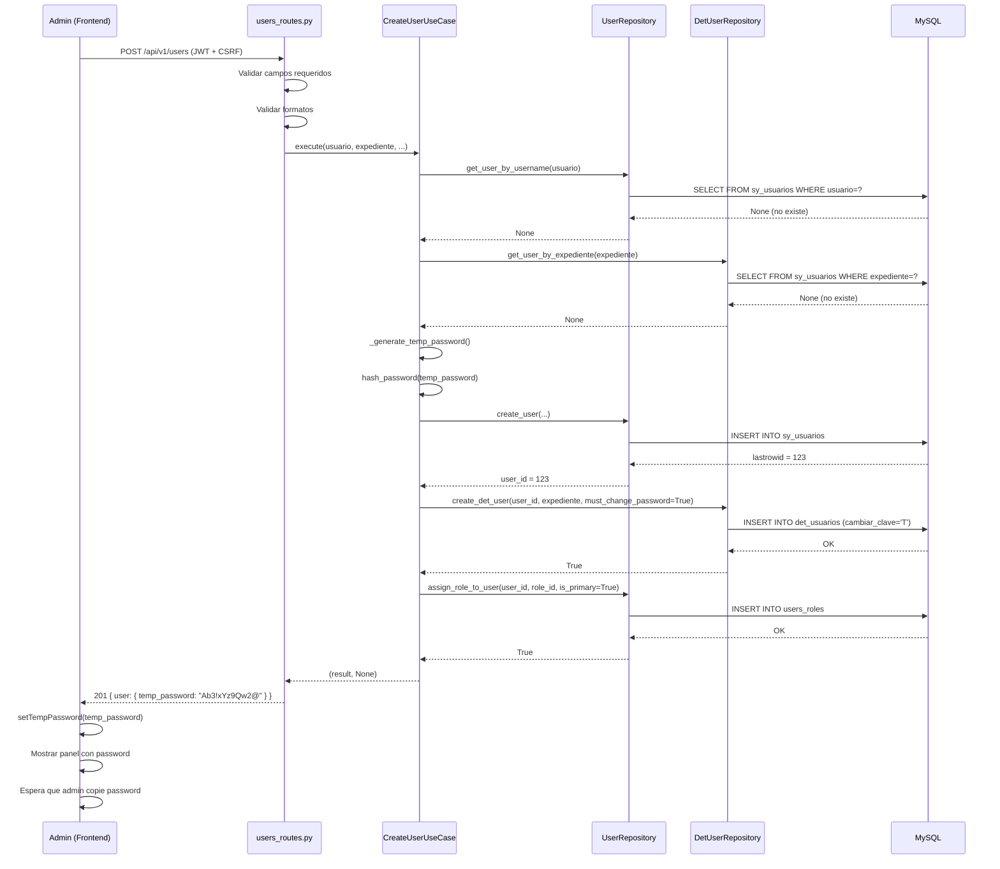

# RBAC 2.0 - Integración Backend ↔ Frontend (Sesión Continuación)

## 🎯 Objetivo de esta sesión

Conectar las páginas de admin (PermissionsPage y CreateUserPage) con endpoints backend reales, eliminando los datos mock y completando el ciclo completo del sistema RBAC 2.0.

---

## 📝 Resumen de Cambios

### Backend - Nuevos Endpoints y Lógica

#### 1. Extensión de `PermissionRepository`

**Archivo:** `backend/src/infrastructure/repositories/permission_repository.py`

**Métodos agregados:**
- `get_all_roles()` - Lista todos los roles con count de permisos
- `get_permissions_by_role_id(role_id)` - Obtiene permisos de un rol específico

**Query ejemplo (get_all_roles):**
```sql
SELECT 
  cr.id_rol,
  cr.rol as cod_rol,
  cr.desc_rol as nom_rol,
  cr.landing_route,
  cr.priority,
  cr.is_admin,
  COUNT(rp.id_permission) as permissions_count
FROM cat_roles cr
LEFT JOIN role_permissions rp ON cr.id_rol = rp.id_rol AND rp.fch_baja IS NULL
WHERE cr.est_rol = 'A'
GROUP BY cr.id_rol
ORDER BY cr.priority ASC
```

**Por qué es importante:** Antes, el frontend usaba roles hardcodeados. Ahora obtiene los roles reales de la base de datos.

---

#### 2. Nuevos Endpoints en `permissions_routes.py`

**Archivo:** `backend/src/presentation/api/permissions_routes.py`

**Endpoints agregados:**

| Método | Ruta | Descripción | Protección |
|--------|------|-------------|------------|
| GET | `/api/v1/permissions/roles` | Lista todos los roles | `@admin_required` |
| GET | `/api/v1/permissions/role/<id>` | Permisos de un rol | `@admin_required` |

**Endpoints existentes (ya funcionaban):**
- POST `/api/v1/permissions/role/<id>/assign` - Asignar permiso
- POST `/api/v1/permissions/role/<id>/revoke` - Revocar permiso
- GET `/api/v1/permissions/catalog` - Catálogo de permisos
- POST `/api/v1/permissions/cache/invalidate` - Limpiar cache

**Ejemplo de respuesta (GET /roles):**
```json
{
  "total": 8,
  "roles": [
    {
      "id_rol": 22,
      "cod_rol": "ADMINISTRADOR",
      "nom_rol": "Administradores del Sistema",
      "landing_route": "/admin",
      "priority": 1,
      "is_admin": 1,
      "permissions_count": 59
    },
    {
      "id_rol": 1,
      "cod_rol": "MEDICOS",
      "nom_rol": "Médicos Especialistas",
      "landing_route": "/consultas",
      "priority": 2,
      "is_admin": 0,
      "permissions_count": 19
    }
  ]
}
```

---

#### 3. Use Case para Crear Usuarios

**Archivo:** `backend/src/use_cases/users/create_user_usecase.py` (NUEVO)

**Responsabilidades:**
1. Validar que usuario y expediente sean únicos
2. Generar contraseña temporal segura (12 chars: mayúscula + minúscula + dígito + símbolo)
3. Crear usuario en `sy_usuarios` con estado activo
4. Crear registro en `det_usuarios` con `cambiar_clave='T'`
5. Asignar rol en `users_roles` con `is_primary=1`
6. Retornar contraseña temporal **una sola vez** en el response

**Pattern aplicado:** Use Case pattern (lógica de negocio desacoplada de HTTP)

**Código de la validación:**
```python
# Validar unicidad de usuario
existing_user = self.user_repo.get_user_by_username(usuario)
if existing_user:
    return None, "USUARIO_EXISTS"

# Validar unicidad de expediente
existing_expediente = self.det_user_repo.get_user_by_expediente(expediente)
if existing_expediente:
    return None, "EXPEDIENTE_EXISTS"
```

**Generación de password segura:**
```python
def _generate_temp_password(self, length: int = 12) -> str:
    chars = [
        secrets.choice(string.ascii_uppercase),
        secrets.choice(string.ascii_lowercase),
        secrets.choice(string.digits),
        secrets.choice("!@#$%&*")
    ]
    all_chars = string.ascii_letters + string.digits + "!@#$%&*"
    chars += [secrets.choice(all_chars) for _ in range(length - 4)]
    secrets.SystemRandom().shuffle(chars)
    return "".join(chars)
```

**Trade-off de seguridad:**
- ✅ **Ganamos:** Password fuerte generado con `secrets` (criptográficamente seguro)
- ⚠️ **Riesgo:** La password viaja en el response inicial (HTTP + TLS)
- 🔒 **Mitigación:** El usuario DEBE cambiarla en el primer login (flag `must_change_password`)

---

#### 4. Extensión de Repositorios

**`DetUserRepository` - Métodos agregados:**
- `get_user_by_expediente(expediente)` - Buscar por número de expediente
- `create_det_user(...)` - Crear registro de detalles con flags de onboarding

**`UserRepository` - Métodos agregados:**
- `create_user(...)` - Insertar usuario en `sy_usuarios` (retorna `lastrowid`)
- `assign_role_to_user(...)` - Insertar en `users_roles` con `is_primary`

**Ejemplo de create_user:**
```python
cursor.execute("""
    INSERT INTO sy_usuarios 
    (usuario, clave, nombre, paterno, materno, expediente, curp, correo, est_usuario, usr_alta, fch_alta)
    VALUES (%s, %s, %s, %s, %s, %s, %s, %s, 'A', %s, NOW())
""", (usuario, clave, nombre, paterno, materno, expediente, curp, correo, created_by))

conn.commit()
return cursor.lastrowid  # ID del usuario creado
```

---

#### 5. Blueprint de Usuarios

**Archivo:** `backend/src/presentation/api/users_routes.py` (NUEVO)

**Endpoint:**
- POST `/api/v1/users` - Crear usuario (admin only)

**Validaciones HTTP:**
- Campos requeridos: `usuario`, `expediente`, `nombre`, `paterno`, `materno`, `curp`, `correo`, `id_rol`
- Formato usuario: 3-20 caracteres
- Formato expediente: 8 dígitos numéricos
- Formato CURP: 18 caracteres
- Email válido

**Mapping de errores:**
```python
error_mapping = {
    "USUARIO_EXISTS": (409, "El nombre de usuario ya está registrado"),
    "EXPEDIENTE_EXISTS": (409, "El expediente ya está registrado"),
    "USER_CREATION_FAILED": (500, "No se pudo crear el usuario"),
    "SERVER_ERROR": (500, "Error interno del servidor"),
}
```

**Respuesta exitosa (201):**
```json
{
  "message": "Usuario creado correctamente. La contraseña temporal debe ser entregada al usuario de forma segura.",
  "user": {
    "id_usuario": 123,
    "usuario": "jperez",
    "expediente": "12345678",
    "temp_password": "Ab3!xYz9Qw2@",
    "must_change_password": true,
    "rol_asignado": 2
  }
}
```

---

#### 6. Registro del Blueprint

**Archivo:** `backend/src/__init__.py`

**Cambio:**
```python
from src.presentation.api.users_routes import users_bp
app.register_blueprint(users_bp, url_prefix="/api/v1/users")
```

---

### Frontend - Tipos y API Resources

#### 7. Types para Permissions

**Archivo:** `frontend/src/api/types/permissions.types.ts` (NUEVO)

**Interfaces principales:**
```typescript
export interface Permission {
  id_permission: number;
  code: string;
  resource: string;
  action: string;
  description: string;
  category: string;
}

export interface Role {
  id_rol: number;
  cod_rol: string;
  nom_rol: string;
  landing_route: string;
  priority: number;
  is_admin: number;
  permissions_count: number;
}
```

---

#### 8. Types para Users

**Archivo:** `frontend/src/api/types/users.types.ts` (NUEVO)

```typescript
export interface CreateUserRequest {
  usuario: string;
  expediente: string;
  nombre: string;
  paterno: string;
  materno: string;
  curp: string;
  correo: string;
  id_rol: number;
}

export interface CreateUserResponse {
  message: string;
  user: {
    id_usuario: number;
    usuario: string;
    expediente: string;
    temp_password: string;  // ⚠️ Sensible
    must_change_password: boolean;
    rol_asignado: number;
  };
}
```

---

#### 9. API Resource para Permissions

**Archivo:** `frontend/src/api/resources/permissions.api.ts` (NUEVO)

**Métodos:**
```typescript
export const permissionsAPI = {
  getCatalog: () => apiClient.get('/permissions/catalog'),
  getRoles: () => apiClient.get('/permissions/roles'),
  getRolePermissions: (roleId) => apiClient.get(`/permissions/role/${roleId}`),
  assignPermission: (roleId, data) => apiClient.post(`/permissions/role/${roleId}/assign`, data),
  revokePermission: (roleId, data) => apiClient.post(`/permissions/role/${roleId}/revoke`, data),
  invalidateCache: (userId?) => apiClient.post('/permissions/cache/invalidate', { user_id: userId }),
};
```

**Importante:** Todos los requests incluyen automáticamente:
- Cookie `access_token` (HttpOnly)
- Header `X-CSRF-TOKEN` (para POST/PUT/PATCH/DELETE)

---

#### 10. API Resource para Users

**Archivo:** `frontend/src/api/resources/users.api.ts` (NUEVO)

```typescript
export const usersAPI = {
  create: async (data: CreateUserRequest): Promise<CreateUserResponse> => {
    const response = await apiClient.post<CreateUserResponse>("/users", data);
    return response.data;
  },
};
```

---

### Frontend - Actualización de CreateUserPage

#### 11. Integración con API Real

**Archivo:** `frontend/src/features/admin/components/CreateUserPage.tsx`

**Cambios principales:**

**Antes (mock):**
```typescript
const MOCK_ROLES = [
  { id: 22, nombre: "ADMINISTRADOR" },
  { id: 1, nombre: "MEDICOS" },
  // ...
];

const onSubmit = async (data) => {
  console.log("Creando usuario:", data);
  await new Promise((resolve) => setTimeout(resolve, 1500));
  toast.success("Usuario creado");
  reset();
};
```

**Después (real):**
```typescript
// Fetch roles desde API
const { data: rolesData, isLoading: isLoadingRoles } = useQuery({
  queryKey: ["roles"],
  queryFn: permissionsAPI.getRoles,
});

// Mutation para crear usuario
const createUserMutation = useMutation({
  mutationFn: usersAPI.create,
  onSuccess: (data) => {
    toast.success("Usuario creado");
    setTempPassword(data.user.temp_password);  // Guardar para mostrar
  },
  onError: (error: any) => {
    const errorMessage = error.response?.data?.message || "Error";
    toast.error(errorMessage);
  },
});

const onSubmit = async (data) => {
  await createUserMutation.mutateAsync({
    usuario: data.usuario,
    expediente: data.expediente,
    // ... resto de campos
    id_rol: parseInt(data.rol),
  });
};
```

---

#### 12. UI para Contraseña Temporal

**Nueva funcionalidad:**

Después de crear un usuario exitosamente, se muestra un panel especial:

```tsx
{tempPassword ? (
  <div className="p-4 bg-status-alert/10 border border-status-alert/30 rounded-lg">
    <p className="text-sm font-semibold text-status-alert">
      ⚠️ CONTRASEÑA TEMPORAL GENERADA
    </p>
    <div className="p-3 bg-bg-paper border border-line-struct rounded font-mono">
      <code className="text-brand font-bold tracking-wide">
        {tempPassword}
      </code>
    </div>
    <p className="text-xs text-txt-muted">
      <strong>IMPORTANTE:</strong> Copiá esta contraseña y entregala
      al usuario de forma segura. Esta es la única vez que será visible.
    </p>
    <Button onClick={() => {
      navigator.clipboard.writeText(tempPassword);
      toast.success("Contraseña copiada al portapapeles");
    }}>
      📋 Copiar Contraseña
    </Button>
  </div>
) : (
  <div className="p-4 bg-status-info/10">
    <p>El sistema generará una contraseña temporal...</p>
  </div>
)}
```

**Por qué es crítico:**
- ⚠️ La password solo existe en memoria del navegador (no se guarda en backend después del response)
- 🔒 El admin debe copiarla y entregarla al usuario de forma segura (ej: en persona, email cifrado)
- 🚫 Si cierra la página, la password se pierde para siempre

---

#### 13. Botones Dinámicos

**Antes:** Siempre mostraba "Crear Usuario" y "Cancelar"

**Después:**
- **Si NO se creó usuario:** "Crear Usuario" + "Cancelar"
- **Si YA se creó usuario:** "Crear Otro Usuario" + "Limpiar"

```tsx
{tempPassword ? (
  <>
    <Button onClick={handleCreateAnother}>
      <UserPlus className="mr-2 size-4" />
      Crear Otro Usuario
    </Button>
    <Button variant="outline" onClick={handleCancel}>
      <X className="mr-2 size-4" />
      Limpiar
    </Button>
  </>
) : (
  <>
    <Button type="submit" disabled={isSubmitting || isLoadingRoles}>
      <Save className="mr-2 size-4" />
      {isSubmitting ? "Creando..." : "Crear Usuario"}
    </Button>
    <Button variant="outline" onClick={handleCancel} disabled={isSubmitting}>
      <X className="mr-2 size-4" />
      Cancelar
    </Button>
  </>
)}
```

---

## 🧪 Cómo Probar

### Test 1: Crear Usuario (Happy Path)

1. Login como admin: `testrbac` / `Test123!`
2. Navegar a `/admin/usuarios/nuevo`
3. Llenar formulario:
   - Usuario: `nuevousr`
   - Expediente: `12345678`
   - Nombre: `Juan`
   - Paterno: `Pérez`
   - Materno: `García`
   - CURP: `PEGJ950101HDFRZN01`
   - Email: `jperez@metro.cdmx.gob.mx`
   - Rol: Seleccionar "Médicos Especialistas"
4. Click "Crear Usuario"
5. **Esperado:**
   - Toast verde: "Usuario creado correctamente"
   - Panel amarillo con contraseña temporal visible
   - Botón "Copiar Contraseña" funcional
   - Botón "Crear Otro Usuario" aparece

### Test 2: Validación de Duplicados

1. Intentar crear usuario con mismo `usuario` o `expediente`
2. **Esperado:**
   - Toast rojo: "El nombre de usuario ya está registrado" o "El expediente ya está registrado"
   - Formulario NO se limpia

### Test 3: Validación de Formato

1. Intentar expediente con 7 dígitos
2. **Esperado:**
   - Error bajo el input: "Debe ser de 8 dígitos"
3. Intentar CURP con 17 caracteres
4. **Esperado:**
   - Error: "CURP debe tener 18 caracteres"

### Test 4: Roles Reales

1. Abrir dropdown de "Rol del Usuario"
2. **Esperado:**
   - Se muestran roles de la base de datos (no los hardcodeados)
   - Incluye: ADMINISTRADOR, MEDICOS, RECEPCION, FARMACIA, etc.

### Test 5: Verificar Usuario Creado

1. Después de crear usuario, abrir MySQL Workbench:
   ```sql
   SELECT * FROM sy_usuarios WHERE usuario = 'nuevousr';
   SELECT * FROM det_usuarios WHERE id_usuario = <id_obtenido>;
   SELECT * FROM users_roles WHERE id_usuario = <id_obtenido>;
   ```
2. **Esperado:**
   - Usuario en `sy_usuarios` con `est_usuario = 'A'`
   - Registro en `det_usuarios` con `cambiar_clave = 'T'`, `terminos_acept = 'F'`
   - Asignación de rol en `users_roles` con `is_primary = 1`

### Test 6: Login con Usuario Nuevo

1. Logout del admin
2. Intentar login con usuario nuevo: `nuevousr` / `<password_temporal>`
3. **Esperado:**
   - Login exitoso
   - Redirect a onboarding (cambiar password)

---

## 📊 Arquitectura del Flujo Completo



---

## 🔐 Consideraciones de Seguridad

### ✅ Medidas Implementadas

1. **Password temporal fuerte:**
   - Generado con `secrets` (criptográficamente seguro)
   - 12 caracteres mínimo
   - Incluye mayúscula, minúscula, dígito, símbolo

2. **Transmisión segura:**
   - Password solo viaja en response inicial (HTTPS en producción)
   - NO se guarda en texto plano en backend
   - NO se loggea

3. **Forzar cambio:**
   - Flag `must_change_password=True` en det_usuarios
   - El usuario NO puede usar el sistema hasta cambiar su password

4. **Protección de endpoint:**
   - `@jwt_required()` - Solo usuarios autenticados
   - `@admin_required()` - Solo administradores

5. **Validaciones:**
   - Unicidad de usuario y expediente
   - Formatos estrictos (CURP, expediente, email)

### ⚠️ Riesgos Residuales

1. **Password en memoria del navegador:**
   - Si el admin no copia la password y cierra la página, se pierde
   - **Mitigación:** UI clara con advertencias y botón "Copiar"

2. **Entrega de password al usuario:**
   - El admin debe entregarla de forma segura (NO por email plano, NO por WhatsApp)
   - **Recomendación:** Entregar en persona o por canal cifrado

3. **No hay email automático:**
   - El sistema NO envía email con la password (esto es intencional)
   - **Ventaja:** Evita que passwords viajen por email (menos seguro)
   - **Desventaja:** Requiere coordinación admin ↔ usuario

---

## 📁 Archivos Creados/Modificados

### Backend (Python)

**Creados:**
- `backend/src/use_cases/users/create_user_usecase.py`
- `backend/src/presentation/api/users_routes.py`

**Modificados:**
- `backend/src/infrastructure/repositories/permission_repository.py` (+2 métodos)
- `backend/src/infrastructure/repositories/det_user_repository.py` (+2 métodos)
- `backend/src/infrastructure/repositories/user_repository.py` (+2 métodos)
- `backend/src/presentation/api/permissions_routes.py` (+2 endpoints)
- `backend/src/__init__.py` (registro de blueprint users)

### Frontend (TypeScript/React)

**Creados:**
- `frontend/src/api/types/permissions.types.ts`
- `frontend/src/api/types/users.types.ts`
- `frontend/src/api/resources/permissions.api.ts`
- `frontend/src/api/resources/users.api.ts`

**Modificados:**
- `frontend/src/features/admin/components/CreateUserPage.tsx` (integración completa con API)

---

## 🎓 Qué Aprendimos

### Patrón: Repository → UseCase → Blueprint

Este proyecto sigue **Clean Architecture** (aproximación):

1. **Repository** (infrastructure): Acceso a datos, queries SQL
   - Solo sabe de MySQL
   - NO tiene lógica de negocio
   - Retorna dicts o valores primitivos

2. **UseCase** (application): Lógica de negocio, orquestación
   - NO sabe de HTTP, Flask, JSON
   - Coordina repos y servicios
   - Retorna `(result, error_code)` (no status HTTP)

3. **Blueprint** (presentation): Mapeo HTTP, validación de request
   - Parsea JSON del request
   - Llama al use case
   - Mapea `error_code` → `(status, message)`
   - Setea headers, cookies

**Por qué es importante:**
- ✅ Testeable: puedo probar `CreateUserUseCase` sin Flask
- ✅ Reutilizable: puedo usar el mismo use case desde API REST, GraphQL, CLI
- ✅ Mantenible: cambios en reglas de negocio NO tocan HTTP

### Patrón: TanStack Query para Server State

En el frontend, **NO guardamos datos del servidor en Zustand**:

- ❌ **Mal:** `const [users, setUsers] = useState([])` + `fetch('/users')`
- ✅ **Bien:** `const { data: users } = useQuery({ queryKey: ['users'], queryFn: usersAPI.list })`

**Ventajas:**
- Cache automático
- Revalidación en background
- Loading/error states integrados
- Invalidación de queries al mutar

**Ejemplo:**
```typescript
const createUserMutation = useMutation({
  mutationFn: usersAPI.create,
  onSuccess: () => {
    queryClient.invalidateQueries(['users']);  // Refetch automático
  },
});
```

### Patrón: Separación de Types y API Resources

En `src/api/`:
- `types/` - Contratos (interfaces, requests, responses)
- `resources/` - Adaptadores (llamadas a apiClient)

**Por qué:**
- Si cambio de `axios` a `fetch`, solo toco `client.ts` y `resources/`
- Los componentes importan de `@api/resources` (abstracción)
- Los types son reutilizables en tests, storybook, etc.

---

## ✅ Checklist de Estado

- ✅ Backend: Endpoints de roles y permisos
- ✅ Backend: Endpoint de crear usuario
- ✅ Backend: Use case con validaciones
- ✅ Backend: Repositorios con métodos necesarios
- ✅ Backend: Blueprint registrado en `__init__.py`
- ✅ Frontend: Types para permissions y users
- ✅ Frontend: API resources
- ✅ Frontend: CreateUserPage integrado con API
- ✅ Frontend: UI para contraseña temporal
- ✅ Frontend: Dropdown de roles dinámico
- ✅ Frontend: Validaciones con Zod
- ✅ Frontend: Manejo de errores con toast

---

## 🚀 Próximos Pasos Sugeridos

### Corto Plazo (Completar Admin)

1. **Conectar PermissionsPage con API real:**
   - Reemplazar `MOCK_ROLES` por `useQuery({ queryKey: ['roles'], queryFn: permissionsAPI.getRoles })`
   - Reemplazar `MOCK_PERMISSIONS_BY_CATEGORY` por `useQuery({ queryKey: ['permissions'], queryFn: permissionsAPI.getCatalog })`
   - Usar `useMutation` para assign/revoke

2. **Crear página de lista de usuarios:**
   - Ruta: `/admin/usuarios`
   - Tabla con búsqueda y filtros
   - Acciones: Ver, Editar, Desactivar
   - Endpoint backend: `GET /api/v1/users` (todavía no existe)

3. **Página de auditoría:**
   - Ruta: `/admin/auditoria`
   - Tabla de access logs
   - Endpoint backend: Ya existe en `access_log_repository.py`, solo falta el route

### Mediano Plazo (UX + Seguridad)

4. **Mejorar UX de password temporal:**
   - Generar QR code con la password
   - Opción de enviar por email cifrado (PGP o similar)
   - Timer de auto-expiración de la password temporal (7 días)

5. **Rate limiting real:**
   - Implementar Redis para OTP y rate limiting (hoy está solo documentado)
   - Proteger `/api/v1/users` con rate limit (máx 10 creaciones/hora por admin)

6. **Tests:**
   - Backend: pytest para `CreateUserUseCase`
   - Frontend: Vitest para `CreateUserPage` (mock de `usersAPI.create`)

### Largo Plazo (Producción)

7. **Migración de RBAC 1.0 → RBAC 2.0:**
   - Script de migración de permisos legacy
   - Plan de rollback documentado

8. **Monitoring:**
   - Logs estructurados (JSON)
   - Alertas si se crean >20 usuarios/día (posible ataque)
   - Dashboard de métricas RBAC (Grafana)

---

## 📚 Referencias Internas

- `RBAC_IMPLEMENTATION_SUMMARY.md` - Guía completa RBAC 2.0
- `PROJECT_GUIDE.md` - Template de features
- `backend/migrations/PHASE_2_BACKEND_IMPLEMENTATION.md` - Docs de migración
- `frontend/src/components/ui/RBAC_EXAMPLES.md` - Ejemplos de uso

---

**Última actualización:** Sesión de continuación - Integración Backend ↔ Frontend

**Estado:** ✅ Listo para testing end-to-end
