# Integración RBAC 2.0 Mock System - Resumen de Cambios

> **Fecha:** 2026-01-05  
> **Objetivo:** Integrar el sistema de usuarios mock RBAC 2.0 con el sistema de autenticación existente  
> **Estado:** ✅ COMPLETADO

---

## 🎯 Problema Resuelto

**Situación inicial:**
- Teníamos 2 sistemas de mocks desincronizados:
  1. `api/mocks/auth.mocks.ts` (viejo, 5 usuarios genéricos)
  2. `mocks/users.mock.ts` (nuevo, 10 usuarios RBAC 2.0 con permisos reales)
- El flag `VITE_USE_MOCKS=true` ya estaba configurado
- El `auth.api.ts` ya estaba preparado para usar mocks
- **PERO:** Los mocks viejos no tenían permisos sincronizados con la BD real

**Resultado:**
- Usuario `recep01` del backend real se logueaba como ADMIN (no como RECEPCION)
- Los permisos de los mocks no coincidían con los de la BD
- No se podía testear el sistema RBAC correctamente

---

## ✅ Solución Implementada

### Paso 1: Refactorización de `auth.mocks.ts`

**Archivo:** `frontend/src/api/mocks/auth.mocks.ts`

**Cambios realizados:**

1. **Importación del sistema RBAC 2.0:**
   ```typescript
   import {
     validateMockCredentials,
     mockLoginResponse,
   } from "@/mocks";
   ```

2. **Reescritura de la función `login()`:**
   - Eliminado usuarios hardcodeados viejos (medico, enfermero, usuario)
   - Agregada validación con `validateMockCredentials()`
   - Agregada generación de respuesta con `mockLoginResponse()`
   - Mantenidos usuarios de error para testing (bloqueado, ratelimit, ipblock, etc.)

3. **Actualización de `getCurrentUser()`:**
   - Ahora lee el usuario desde `localStorage` (persisted por Zustand)
   - Fallback a admin si no hay usuario guardado
   - Logs de debugging con prefijo `🧪 [MOCK AUTH]`

4. **Actualización de documentación inline:**
   - Tabla de usuarios actualizada con los 10 usuarios RBAC 2.0
   - Referencias a `frontend/src/mocks/README.md` agregadas

**Líneas modificadas:** ~150 líneas

---

### Paso 2: Verificación de Build

**Comando ejecutado:**
```bash
cd frontend && bun run build
```

**Resultado:**
- ✅ Build exitoso
- ✅ 0 errores de TypeScript
- ⚠️ Warning de bundle size >500KB (esperado, no crítico)

**Tiempo de build:** 31.30s

---

## 📁 Archivos Modificados

| Archivo | Cambios | Estado |
|---------|---------|--------|
| `frontend/src/api/mocks/auth.mocks.ts` | Refactorización completa de login() y getCurrentUser() | ✅ Listo |
| `frontend/TESTING_RBAC_MANUAL.md` | Creado nuevo manual de testing (340+ líneas) | ✅ Listo |

---

## 🧪 Sistema de Mocks Unificado

### Usuarios Disponibles (10 + edge cases)

#### Usuarios Reales RBAC 2.0

| # | Usuario | Password | Rol | Permisos | Landing | Secciones Sidebar |
|---|---------|----------|-----|----------|---------|-------------------|
| 1 | `admin` | `Admin123!` | ADMINISTRADOR | `["*"]` | `/admin` | 7 (todas) |
| 2 | `drgarcia` | `Doc123!` | MEDICOS | 15 | `/consultas` | 3 |
| 3 | `drlopez` | `Esp123!` | ESPECIALISTAS | 16 | `/consultas` | 4 |
| 4 | `recep01` | `Recep123!` | RECEPCION | 10 | `/recepcion` | 2 |
| 5 | `farm01` | `Farm123!` | FARMACIA | 6 | `/farmacia` | 2 |
| 6 | `urg01` | `Urg123!` | URGENCIAS | 13 | `/urgencias` | 4 |
| 7 | `coordhosp` | `Hosp123!` | HOSP-COORDINACION | 5 | `/hospital` | 2 |
| 8 | `gerente01` | `Ger123!` | GERENCIA | 11 | `/reportes` | 3 |
| 9 | `jefeclinica` | `Jefe123!` | JEFATURA CLINICA | 20 | `/consultas` | 6 |
| 10 | `trans01` | `Trans123!` | TRANS-RECETA | 5 | `/farmacia` | 2 |

#### Usuarios de Error (Testing)

| Usuario | Password | Error Code | Status | Descripción |
|---------|----------|------------|--------|-------------|
| `inactivo` | cualquiera | `USER_INACTIVE` | 403 | Usuario deshabilitado |
| `noexiste` | cualquiera | `USER_NOT_FOUND` | 404 | No existe en sistema |
| `error` | cualquiera | `INVALID_CREDENTIALS` | 401 | Credenciales inválidas |
| cualquiera | `mal` | `INVALID_CREDENTIALS` | 401 | Password incorrecto |
| `fail` | cualquiera | `INTERNAL_SERVER_ERROR` | 500 | Error servidor |
| `bloqueado` | cualquiera | `USER_LOCKED` | 423 | Bloqueado 5 min |
| `bloqueado1h` | cualquiera | `USER_LOCKED` | 423 | Bloqueado 1 hora |
| `bloqueado24h` | cualquiera | `USER_LOCKED` | 423 | Bloqueado 24 horas |
| `ratelimit` | cualquiera | `TOO_MANY_REQUESTS` | 429 | Rate limit 1 min |
| `ratelimit5` | cualquiera | `TOO_MANY_REQUESTS` | 429 | Rate limit 5 min |
| `ipblock` | cualquiera | `IP_BLOCKED` | 403 | IP bloqueada 15 min |
| `ipblock1h` | cualquiera | `IP_BLOCKED` | 403 | IP bloqueada 1 hora |
| `ipblock24h` | cualquiera | `IP_BLOCKED` | 403 | IP bloqueada 24 horas |

---

## 🔄 Flujo de Autenticación Mock

```mermaid
graph TD
    A[LoginForm] -->|usuario + password| B[authAPI.login]
    B -->|VITE_USE_MOCKS=true| C{Modo Mock?}
    C -->|SÍ| D[authMocks.login]
    C -->|NO| E[realAuthAPI.login]
    
    D -->|validateMockCredentials| F{Usuario válido?}
    F -->|NO| G[throw INVALID_CREDENTIALS]
    F -->|SÍ| H[mockLoginResponse]
    
    H --> I[Retorna LoginResponse]
    I --> J[authStore.setAuth]
    J --> K[localStorage persist]
    K --> L[Redirect a landing_route]
```



---

## 📝 Cómo Usar (Para Testing)

### 1. Verificar configuración

**Archivo:** `frontend/.env`

```bash
# Debe estar en "true"
VITE_USE_MOCKS=true
```

### 2. Iniciar dev server

```bash
cd frontend
bun dev
# → http://localhost:5173
```

### 3. Testear login

Abrí el navegador en `http://localhost:5173` y probá:

**Test básico:**
- Usuario: `admin`
- Password: `Admin123!`
- Esperado: Redirect a `/admin`, sidebar con 7 secciones

**Test RBAC:**
- Usuario: `recep01`
- Password: `Recep123!`
- Esperado: Redirect a `/recepcion`, sidebar con SOLO Recepción + Expedientes

**Test error:**
- Usuario: `bloqueado`
- Password: `cualquiera`
- Esperado: Error "Usuario bloqueado por 5:00 minutos"

### 4. Debugging

Abrí DevTools (`F12`) y filtrá por `🧪`:

```
🧪 [MOCK AUTH] Intento de login: recep01
🧪 [MOCK AUTH] Login exitoso: {
  usuario: "recep01",
  roles: ["RECEPCION"],
  permissions: 10,
  landing: "/recepcion"
}
```

---

## ✅ Checklist de Validación

Antes de considerar esta integración completa, verificá:

- [x] Build de frontend exitoso sin errores TS
- [x] `VITE_USE_MOCKS=true` en frontend/.env
- [ ] Login con `admin` muestra 7 secciones sidebar
- [ ] Login con `recep01` muestra SOLO 2 secciones sidebar
- [ ] Login con `farm01` muestra SOLO 2 secciones sidebar
- [ ] Usuario `recep01` NO puede acceder a `/admin`
- [ ] Usuario `farm01` NO puede acceder a `/consultas`
- [ ] Usuarios de error muestran toasts correctos
- [ ] Logout limpia localStorage correctamente
- [ ] Landing routes redirigen correctamente

---

## 🐛 Troubleshooting

### Problema: Sigue mostrando backend real

**Síntoma:** `recep01` aparece como ADMIN

**Solución:**
1. Verificá `frontend/.env` tenga `VITE_USE_MOCKS=true`
2. Reiniciá dev server: `Ctrl+C` → `bun dev`
3. Hard refresh navegador: `Ctrl+Shift+R`
4. Limpiar localStorage: `localStorage.clear()`

---

### Problema: Console logs no aparecen

**Síntoma:** No ves `🧪 [MOCK AUTH]` en console

**Solución:**
1. Abrí DevTools (`F12`)
2. Pestaña "Console"
3. Verificá que el filtro no esté ocultando logs
4. Ejecutá: `import.meta.env.VITE_USE_MOCKS` (debería retornar `"true"`)

---

### Problema: Login falla con "USER_NOT_FOUND"

**Síntoma:** Usuario válido da error 404

**Solución:**
1. Verificá que estés usando el username correcto (ej: `drgarcia`, NO `dr.garcia`)
2. Los usernames son case-insensitive (se convierten a lowercase)
3. Revisá tabla de usuarios en `TESTING_RBAC_MANUAL.md`

---

## 📚 Documentación Relacionada

- **Manual de Testing:** `frontend/TESTING_RBAC_MANUAL.md` (este archivo)
- **Usuarios Mock:** `frontend/src/mocks/README.md`
- **Implementación Mock:** `frontend/src/api/mocks/auth.mocks.ts`
- **Sistema RBAC 2.0:** `frontend/src/mocks/users.mock.ts`
- **Migraciones BD:** `backend/migrations/004_rbac_assign_permissions.sql`

---

## 🚀 Próximos Pasos

1. **Testing Manual Completo** (ver `TESTING_RBAC_MANUAL.md`)
   - Testear los 10 usuarios
   - Testear edge cases
   - Testear protección de rutas
   - Documentar resultados en `TESTING_RESULTS.md`

2. **Corrección de Bugs** (si se encuentran)
   - Ajustar permisos si no coinciden
   - Ajustar sidebar filtering si falla
   - Ajustar route guards si no bloquean

3. **Tests Automatizados** (siguiente sprint)
   - Vitest + React Testing Library
   - Tests de login con diferentes usuarios
   - Tests de sidebar filtering
   - Tests de route protection

4. **Integración con Backend Real** (producción)
   - Cambiar `VITE_USE_MOCKS=false`
   - Verificar que backend retorne mismo formato de permisos
   - Verificar que landing_route venga del backend

---

**Estado Final:** ✅ Sistema de mocks RBAC 2.0 integrado y listo para testing manual
